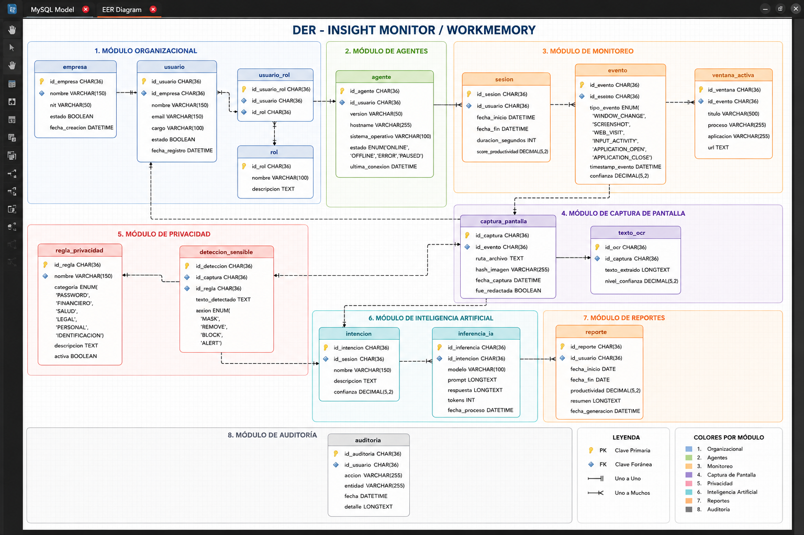

# Database Schema

SQLite database with WAL mode, thread-safe singleton connection. Tables created at `backend/storage/database.py:_init_schema()`.

## Tables

### `raw_events`

Stores atomic units of captured activity.

| Column | Type | Notes |
|---|---|---|
| `id` | INTEGER | Primary key, autoincrement |
| `event_id` | TEXT | UUID, unique |
| `event_type` | TEXT | window_focus, screenshot, input_activity, url_context, session_boundary |
| `timestamp` | TEXT | ISO 8601 |
| `source` | TEXT | Default 'capture-agent' |
| `window_title` | TEXT | Nullable |
| `process_name` | TEXT | Nullable |
| `pid` | INTEGER | Nullable |
| `screenshot_path` | TEXT | Nullable |
| `screenshot_thumbnail` | TEXT | Nullable |
| `clicks_per_min` | REAL | Nullable |
| `keystrokes_per_min` | REAL | Nullable |
| `url` | TEXT | Nullable |
| `browser_tab_title` | TEXT | Nullable |
| `session_id` | TEXT | Nullable, foreign key to sessions |
| `session_boundary_type` | TEXT | Nullable |

Indexes: `idx_events_session(session_id)`, `idx_events_timestamp(timestamp)`

### `sessions`

Aggregated view of a work session.

| Column | Type | Notes |
|---|---|---|
| `id` | TEXT | Primary key |
| `start_time` | TEXT | ISO 8601 |
| `end_time` | TEXT | Nullable |
| `duration_seconds` | REAL | Nullable |
| `app_sequence` | TEXT | JSON array |
| `event_count` | INTEGER | Default 0 |
| `screenshot_count` | INTEGER | Default 0 |
| `avg_clicks_per_min` | REAL | Nullable |
| `avg_keystrokes_per_min` | REAL | Nullable |
| `active_apps` | TEXT | JSON array |
| `session_type` | TEXT | Nullable, denormalized from intent_records |
| `goal` | TEXT | Nullable |
| `confidence` | REAL | Nullable |
| `status` | TEXT | Default 'open' |
| `created_at` | TEXT | Auto timestamp |

Indexes: `idx_sessions_status(status)`

### `intent_records`

LLM inference output with confidence scoring.

| Column | Type | Notes |
|---|---|---|
| `id` | TEXT | Primary key |
| `session_id` | TEXT | Foreign key → sessions(id) |
| `timestamp` | TEXT | ISO 8601 |
| `session_type` | TEXT | skill_development, applied_learning, peer_collaboration, ambiguous, personal |
| `goal` | TEXT | Nullable |
| `goal_confidence` | REAL | 0.0–1.0 |
| `friction_points` | TEXT | JSON array |
| `friction_confidence` | REAL | Nullable |
| `category` | TEXT | Default 'ambiguous' |
| `category_confidence` | REAL | Default 0.0 |
| `tags` | TEXT | JSON array |
| `evidence` | TEXT | JSON array |
| `alternatives` | TEXT | JSON array |
| `app_summary` | TEXT | JSON object, migration-added |
| `raw_timeline_summary` | TEXT | Migration-added |
| `raw_llm_response` | TEXT | Nullable |
| `created_at` | TEXT | Auto timestamp |

Indexes: `idx_intent_session(session_id)`

## Migrations

The `_migrate()` method runs additive migrations on startup:
1. `ALTER TABLE intent_records ADD COLUMN app_summary`
2. `ALTER TABLE intent_records ADD COLUMN raw_timeline_summary`
